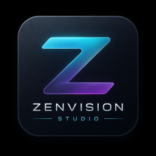
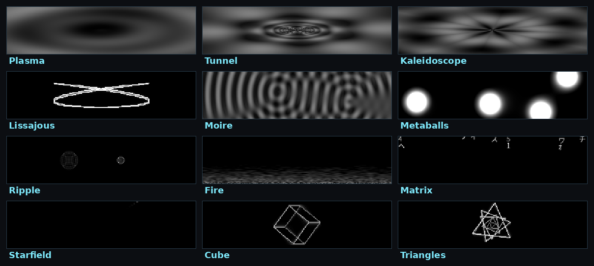
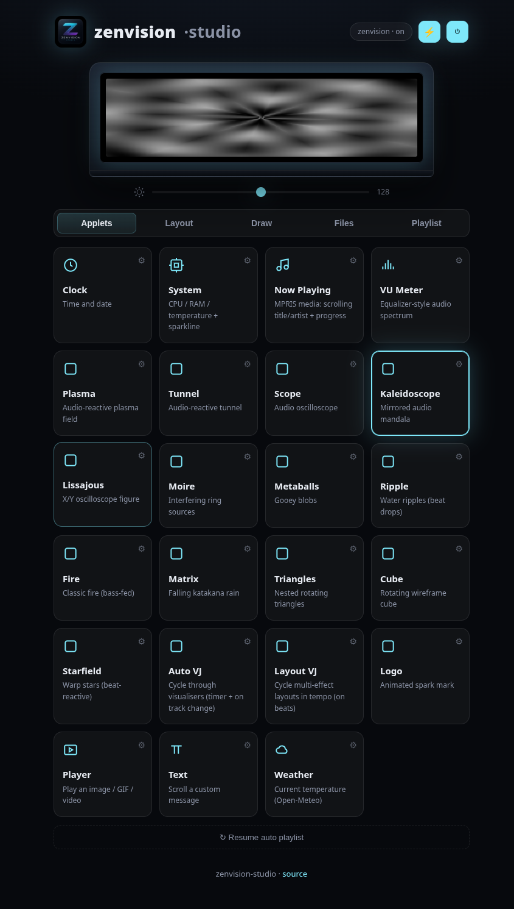
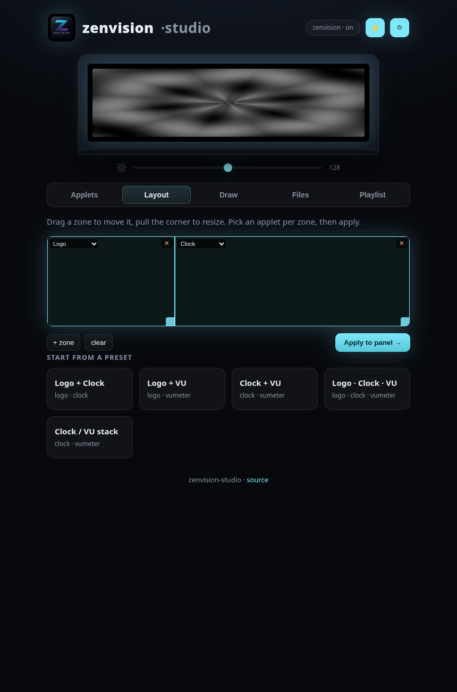
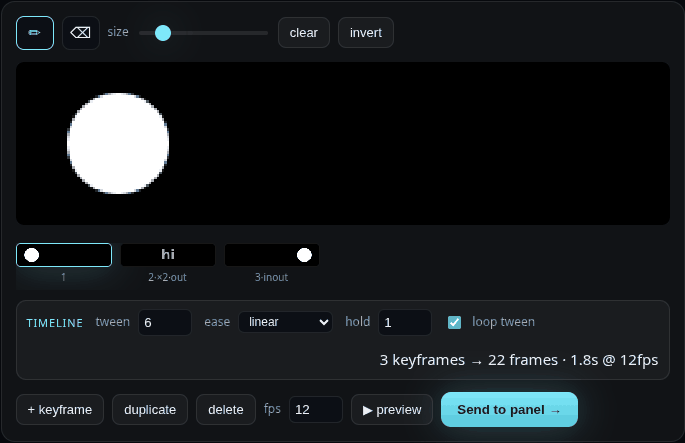

<div align="center">

#  zenvision-studio

**Turn the lid OLED of an ASUS Zenbook into a live dashboard and a beat-reactive VJ screen — on Linux.**

🟢 *The first open-source Linux support for the ASUS **ZenVision** lid OLED.*
The protocol was reverse-engineered from scratch (Ghidra on MyASUS) and lives in the
companion driver **[zenvision-linux](https://github.com/tarpediem/zenvision-linux)**.


*Audio-reactive visualisers on the actual lid OLED of an ASUS Zenbook 14X OLED Space Edition (UX5401ZAS).*

[](https://github.com/tarpediem/zenvision-studio/actions)
&nbsp;·&nbsp; MIT &nbsp;·&nbsp; cross-desktop &nbsp;·&nbsp; control it from your phone

</div>

---

## What is this?

The Zenbook 14X OLED Space Edition has a tiny **256×64 monochrome OLED in the lid**
("ZenVision"). ASUS only ships a Windows app for it. This project drives it from
Linux with a small **daemon + web UI**: live **applets** (clock, system stats,
now-playing…), a gallery of **audio-reactive demoscene visualisers**, an
**in-browser timeline animation editor** (keyframes + tweening), and a
**drag-and-drop zone layout** so you can put several effects on screen at once.

No `/dev/fb`, no GUI toolkit lock-in — just push grayscale frames over USB. Works the
same on KDE, GNOME, Sway, or headless.

## Visualisers



Plasma · tunnel · kaleidoscope · Lissajous · moiré · metaballs · ripple · fire ·
katakana **Matrix** rain · starfield · wireframe cube · triangles — plus a VU-meter
spectrum and an audio oscilloscope. All grayscale-graded with **MilkDrop-style
trails**, a global **beat-flash**, an **Auto-VJ** that cycles them, and a **Layout-VJ**
that switches multi-effect compositions **in tempo**.

## The web UI

| Dashboard | Zone layout editor | Timeline animation editor |
|---|---|---|
|  |  |  |

Live mirror of the panel, brightness/power, per-applet settings, a drag-and-drop
**zone editor** (split the panel into regions), and a stylus-friendly **timeline editor**:
draw keyframes, then **tween** between them with per-keyframe **easing** (linear /
ease-in / out / in-out), **hold** durations and a seamless **loop tween** — the editor
interpolates the in-between frames and streams the result to the panel. Reachable from
your phone over the LAN / Tailscale.

## Features

- **Applets**: clock, system monitor (CPU/RAM/temp + sparkline), now-playing
  (MPRIS marquee + progress), text marquee, weather (Open-Meteo), media player
  (image / GIF / video).
- **Audio-reactive visualisers** (see above) with trails, beat-flash, Auto-VJ and a
  tempo-synced Layout-VJ.
- **Web UI**: live panel mirror, per-applet settings, zone layout editor, in-browser
  **timeline** animation editor (keyframes/tween/easing/loop), drag-and-drop upload —
  works from a phone.
- **Compositor**: rotates a playlist of scenes; an applet can *preempt* (now-playing
  pops in on a track change). Flicker-free streaming.
- **Cross-desktop**: a headless daemon + a browser page — nothing depends on KDE/GNOME.
- **Hardware-free dev**: a `mock` backend renders to a preview/PNG, so the whole stack
  (and CI) runs with no device attached.
- **Pluggable**: third-party applets register via the `zvstudio.applets` entry point.

## Install

```bash
python -m venv .venv && . .venv/bin/activate
pip install -e ".[audio,video]"     # audio = numpy (spectrum/visualisers); video = imageio
```

Non-root USB access:

```bash
sudo cp udev/99-zenvision.rules /etc/udev/rules.d/
sudo udevadm control --reload-rules && sudo udevadm trigger
```

The VU-meter / visualisers read system audio levels via `parec` (PipeWire/PulseAudio).

## Run

```bash
# Start the daemon + web UI (real panel auto-detected, else mock)
zvstudio daemon                      # open http://127.0.0.1:8787

# No hardware? Force the mock backend and watch the live preview in the browser:
ZVSTUDIO_BACKEND=mock zvstudio daemon

# CLI
zvstudio status
zvstudio show plasma
zvstudio brightness 0x80
zvstudio power off

# Or skip the daemon for a one-shot:
zvstudio play picture.png
zvstudio anim frames/ --fps 20
```

Run at login (systemd user service, runs as your user so now-playing/MPRIS works):

```bash
cp systemd/zvstudio.service ~/.config/systemd/user/
systemctl --user enable --now zvstudio
```

## Write an applet

An applet returns one 256×64 grayscale frame per tick:

```python
from zvstudio.core.applets.base import Applet, AppletMeta, Ctx
from zvstudio.core import frame as F

class HelloApplet(Applet):
    meta = AppletMeta(key="hello", name="Hello", description="says hi")

    def render(self, ctx: Ctx):
        img = F.canvas(*self.size)
        F.text(img, (self.size[0] // 2, 32), "hello :)", size=22, anchor="mm")
        return img
```

Register it via a `[project.entry-points."zvstudio.applets"]` entry and it shows up in
the UI automatically. Full example in [`examples/`](examples/).

## Architecture

```
device/      Panel backends — zenvision (USB) + mock (no hardware)
applets/     Applet plugins (clock, sysmon, viz/fx/geo, …) — render(ctx) -> 256x64 'L'
compositor   Render loop: playlist + preempt + beat-flash, flicker-free streaming
daemon/api   FastAPI: REST + live preview + zone layout + draw upload
web/         Vanilla-JS dashboard, zone editor, frame editor (no build step)
```

## Roadmap

**Already shipped** (was the v2 wishlist): in-browser **timeline animation editor**
(keyframes + tween + easing + loop), weather + **VU-meter** applets, the full
audio-reactive visualiser / Auto-VJ suite, drag-and-drop zone layouts, and the
now-playing **preempt** trigger.

**Next:** richer triggers (notifications, lid events, idle) · more applets
(RSS/ticker, calendar) · more panels behind the `Panel` abstraction · PyPI / AUR
packaging.

## Credits

Built on the reverse-engineered protocol documented in
**[zenvision-linux](https://github.com/tarpediem/zenvision-linux)**. Unofficial; not
affiliated with or endorsed by ASUS.

## License

[MIT](LICENSE).
